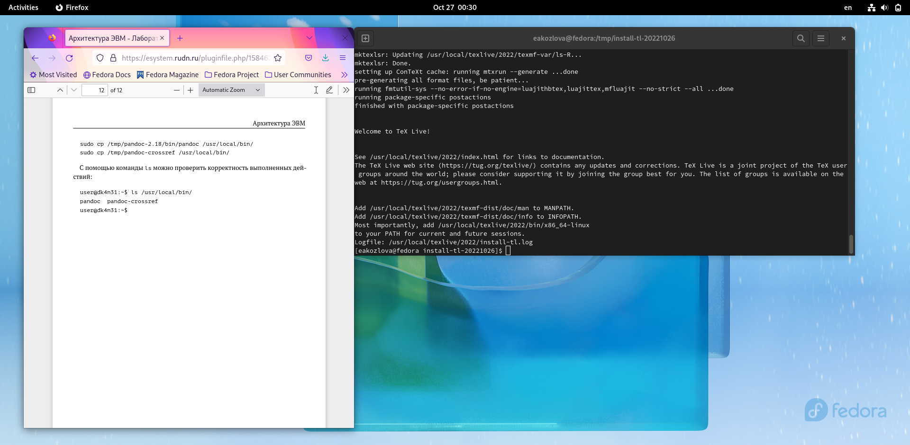
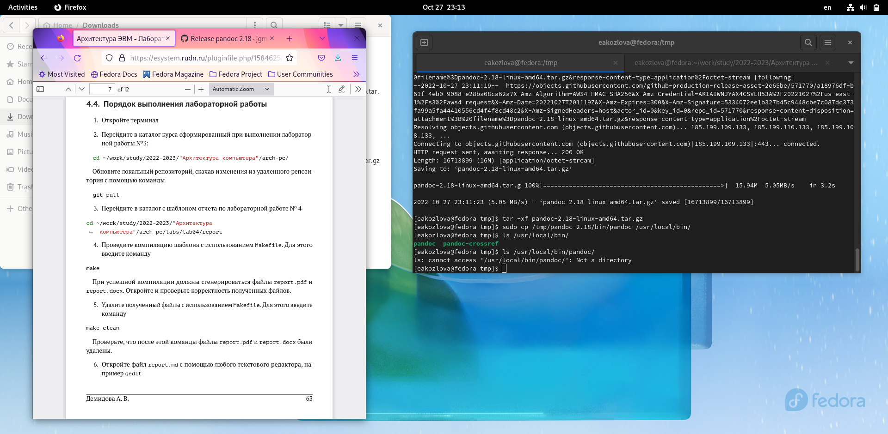
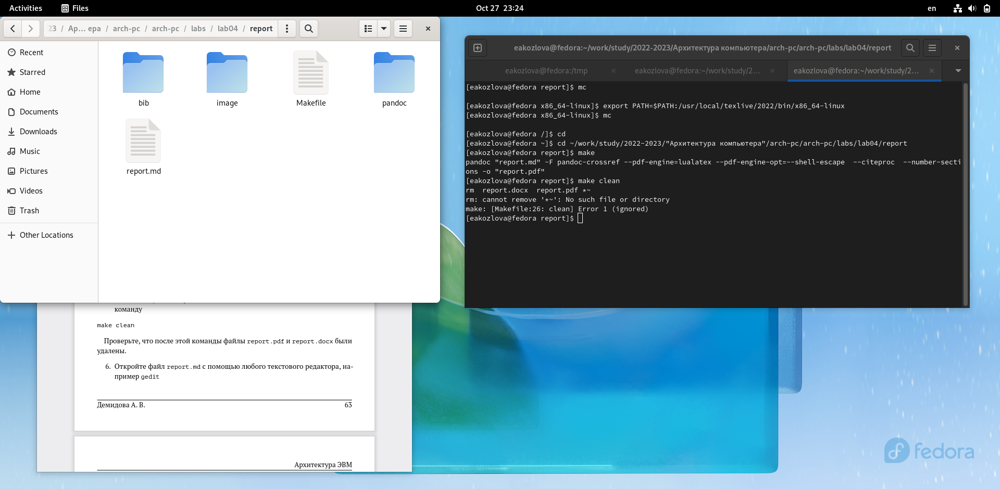
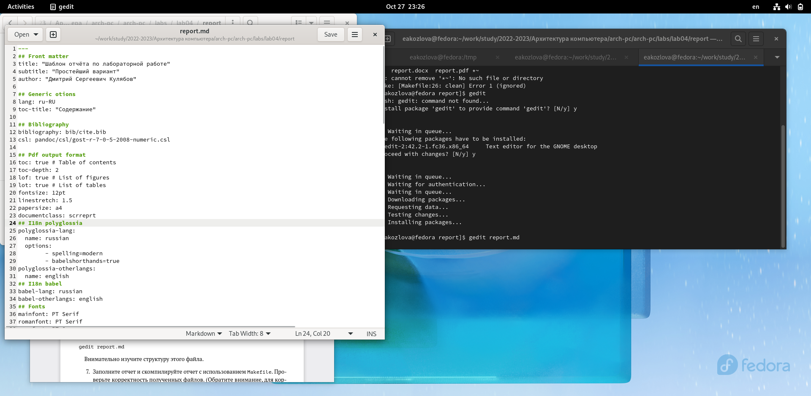

---
## Front matter
title: "Отчёт по лабораторной работе"
subtitle: "Язык разметки Markdown"
author: "Козлова Екатерина Алексеевна"

## Generic otions
lang: ru-RU
toc-title: "Содержание"

## Bibliography
bibliography: bib/cite.bib
csl: pandoc/csl/gost-r-7-0-5-2008-numeric.csl

## Pdf output format
toc: true # Table of contents
toc-depth: 2
lof: true # List of figures
lot: true # List of tables
fontsize: 12pt
linestretch: 1.5
papersize: a4
documentclass: scrreprt
## I18n polyglossia
polyglossia-lang:
  name: russian
  options:
	- spelling=modern
	- babelshorthands=true
polyglossia-otherlangs:
  name: english
## I18n babel
babel-lang: russian
babel-otherlangs: english
## Fonts
mainfont: PT Serif
romanfont: PT Serif
sansfont: PT Sans
monofont: PT Mono
mainfontoptions: Ligatures=TeX
romanfontoptions: Ligatures=TeX
sansfontoptions: Ligatures=TeX,Scale=MatchLowercase
monofontoptions: Scale=MatchLowercase,Scale=0.9
## Biblatex
biblatex: true
biblio-style: "gost-numeric"
biblatexoptions:
  - parentracker=true
  - backend=biber
  - hyperref=auto
  - language=auto
  - autolang=other*
  - citestyle=gost-numeric
## Pandoc-crossref LaTeX customization
figureTitle: "Рис."
tableTitle: "Таблица"
listingTitle: "Листинг"
lofTitle: "Список иллюстраций"
lotTitle: "Список таблиц"
lolTitle: "Листинги"
## Misc options
indent: true
header-includes:
  - \usepackage{indentfirst}
  - \usepackage{float} # keep figures where there are in the text
  - \floatplacement{figure}{H} # keep figures where there are in the text
---

# Цель работы

Освоить процедуры оформления отчётов с помощью легковесного языка разметки Markdown.

# Задание

1) Установить следующее ПО: 

• TeX Live (https://www.tug.org/texlive/) последней версии

• Pandoc (https://pandoc.org/) версии v2.18

• Pandoc-crossref (https://github.com/lierdakil/pandoc-crossref/releases) версии v0.3.13.0

# Теоретическое введение

В табл. [-@tbl:std-dir] приведено краткое описание стандартных каталогов Unix.

: Описание некоторых каталогов файловой системы GNU Linux {#tbl:std-dir}

| Имя каталога | Описание каталога                                                                                                          |
|--------------|----------------------------------------------------------------------------------------------------------------------------|
| `/`          | Корневая директория, содержащая всю файловую                                                                               |
| `/bin `      | Основные системные утилиты, необходимые как в однопользовательском режиме, так и при обычной работе всем пользователям     |
| `/etc`       | Общесистемные конфигурационные файлы и файлы конфигурации установленных программ                                           |
| `/home`      | Содержит домашние директории пользователей, которые, в свою очередь, содержат персональные настройки и данные пользователя |
| `/media`     | Точки монтирования для сменных носителей                                                                                   |
| `/root`      | Домашняя директория пользователя  `root`                                                                                   |
| `/tmp`       | Временные файлы                                                                                                            |
| `/usr`       | Вторичная иерархия для данных пользователя                                                                                 |

Более подробно об Unix см. в [@gnu-doc:bash;@newham:2005:bash;@zarrelli:2017:bash;@robbins:2013:bash;@tannenbaum:arch-pc:ru;@tannenbaum:modern-os:ru].

# Выполнение лабораторной работы

*Сначала я устанавливаю ПО TeXlive, pandoc и pandoc-crossref*

Захожу в пространство tmp: 

TeXlive
Скачиваю файл с репозитория, ввожу команду установки в терминале, распаковываю архив и запускаю скрипт с правами администратора 

(рис. [-@fig:001]){#fig:001 width=70%}

После установки TeXlive добавляю путь для текущей и будущих сессий (см рис 4)

Pandoc и pandoc-crossref
Скачиваю нужны файлы с соответствием версий, ввожу команду установки, распаковываю архив 
Копирую файлы pandoc и pandoc-crossref в каталог /usr/local/bin 

(рис. [-@fig:002]){#fig:002 width=70%}

*Перехожу к выполнению основной лабораторной работы*

Перехожу в каталог курса и обнавляю локальный репозиторий, скачав изменения из удаленного репозиторию с помощью git pull. 

Провожу компиляцию шаблона с использованием Makefile командой make, получились два файла report.pdf и report.docx. Удаляю полученные файлы с помощью make clean. Открываю отчёт в формате md с помощью редактора gedit и заполняю его 

(рис. [-@fig:003]){#fig:003 width=70%} 

(рис. [-@fig:004]){#fig:004 width=70%}

(рис. [-@fig:005]){#fig:005 width=70%}

Загружаю файлы на GitHub

# Выводы

В результате выполнения лабораторной работы я освоила процедуры оформления отчётов с помощью легковесного языка разметки Markdown.

# Список литературы{.unnumbered}

